# Kill-Chain Maps by Posture

Executive-ready MITRE ATT&CK kill-chain views for each of the 12 social-engineering postures.
Each map shows the ordered phases, ATT&CK techniques, and planned scripts (one technique per
script). Scripts are safe simulations and not yet implemented.

## Visual options
- **Inline previews (GitHub-friendly):** SVG previews generated from the Navigator layers live under
  `mitre/navigator/previews/` and render directly in GitHub. Each shows the ordered steps, tactic,
  ATT&CK ID, and planned script.
- **ATT&CK Navigator layers:** Import the posture-specific JSON layers from `mitre/navigator/*.json`
  into https://mitre-attack.github.io/attack-navigator/ to see tactic-aligned tiles with ordering
  metadata.
- **Mermaid flow diagrams:** Inline flowcharts illustrate the kill-chain order for quick review.

## Legend
- Phases follow MITRE ATT&CK.
- Techniques include ATT&CK IDs.
- Scripts are planned names matching `labs/postures/*.yaml` manifests.
- Order is the execution sequence within each posture.

---

## 01 Reduced MFA coverage
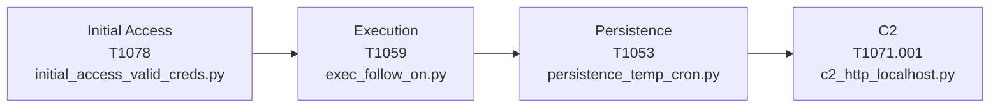

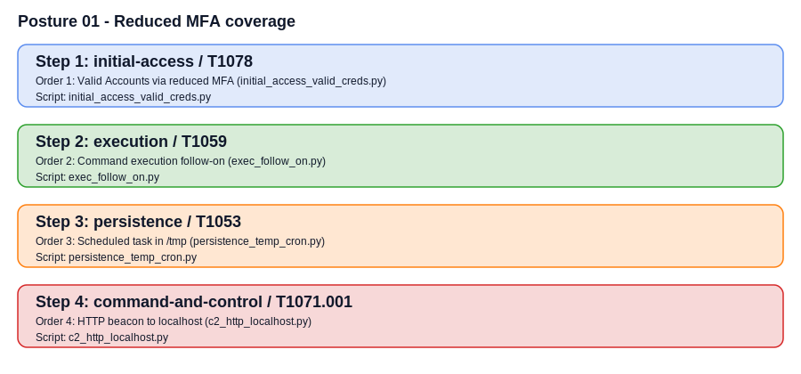

| Order | Phase              | Technique (ATT&CK)                  | Planned Script                |
|-------|--------------------|-------------------------------------|-------------------------------|
| 1     | Initial Access     | Valid Accounts (T1078)              | initial_access_valid_creds.py |
| 2     | Execution          | Command Execution (T1059)           | exec_follow_on.py             |
| 3     | Persistence        | Scheduled Task/Job (T1053)          | persistence_temp_cron.py      |
| 4     | Command & Control  | App Layer Protocol: Web (T1071.001) | c2_http_localhost.py          |

## 01 Reduced MFA coverage
| Order | Phase              | Technique (ATT&CK)             | Planned Script                  |
|-------|--------------------|--------------------------------|---------------------------------|
| 1     | Initial Access     | Valid Accounts (T1078)         | initial_access_valid_creds.py   |
| 2     | Execution          | Command Execution (T1059)      | exec_follow_on.py               |
| 3     | Persistence        | Scheduled Task/Job (T1053)     | persistence_temp_cron.py        |
| 4     | Command & Control  | App Layer Protocol: Web (T1071.001) | c2_http_localhost.py      |

## 02 Over-privileged user promotion
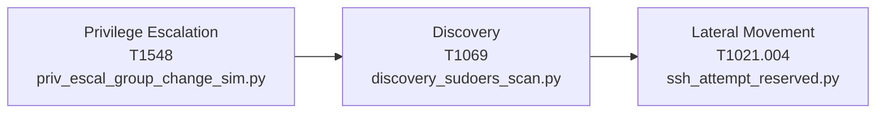

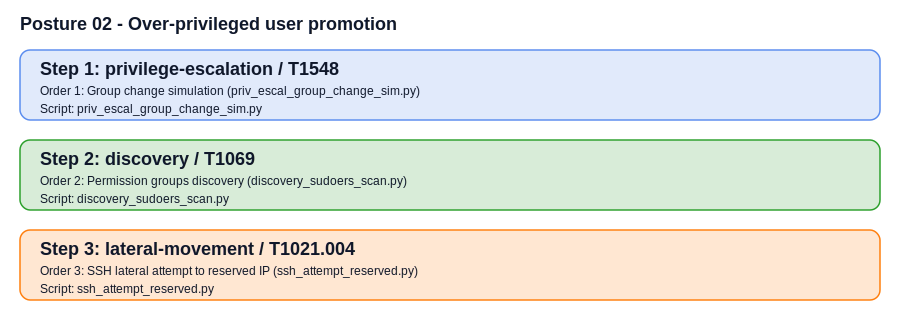

| Order | Phase                 | Technique (ATT&CK)                     | Planned Script                    |
|-------|-----------------------|----------------------------------------|-----------------------------------|
| 1     | Privilege Escalation  | Abuse Elevation Control (T1548)        | priv_escal_group_change_sim.py    |
| 2     | Discovery             | Permission Groups Discovery (T1069)    | discovery_sudoers_scan.py         |
| 3     | Lateral Movement      | Remote Services: SSH (T1021.004)       | ssh_attempt_reserved.py           |

## 03 Email security relaxation
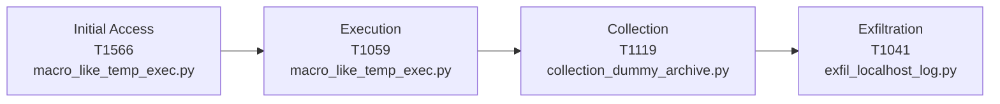

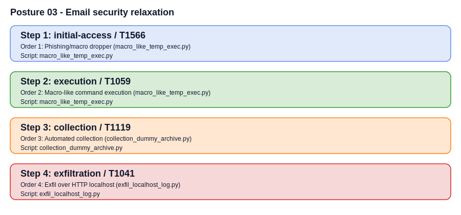

| Order | Phase              | Technique (ATT&CK)                     | Planned Script                   |
|-------|--------------------|----------------------------------------|----------------------------------|
| 1     | Initial Access     | Phishing (T1566)                       | macro_like_temp_exec.py          |
| 2     | Execution          | Command Execution (T1059)              | macro_like_temp_exec.py          |
| 3     | Collection         | Automated Collection (T1119)           | collection_dummy_archive.py      |
| 4     | Exfiltration       | Exfiltration Over C2 Channel (T1041)   | exfil_localhost_log.py           |

## 04 Execution policy weakening
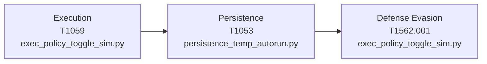

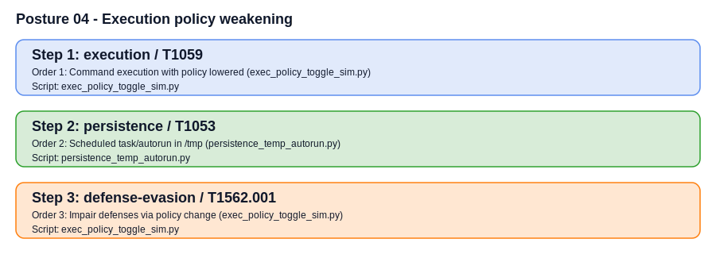

| Order | Phase              | Technique (ATT&CK)                    | Planned Script                    |
|-------|--------------------|---------------------------------------|-----------------------------------|
| 1     | Execution          | Command Execution (T1059)             | exec_policy_toggle_sim.py         |
| 2     | Persistence        | Scheduled Task/Job (T1053)            | persistence_temp_autorun.py       |
| 3     | Defense Evasion    | Impair Defenses (T1562.001)           | exec_policy_toggle_sim.py         |

## 05 Endpoint protection exclusions
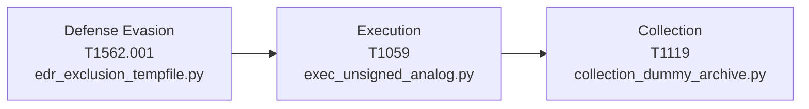

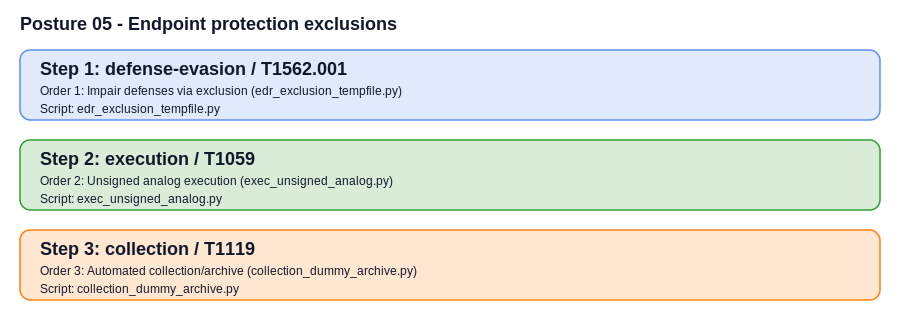

| Order | Phase              | Technique (ATT&CK)                    | Planned Script                    |
|-------|--------------------|---------------------------------------|-----------------------------------|
| 1     | Defense Evasion    | Impair Defenses (T1562.001)           | edr_exclusion_tempfile.py         |
| 2     | Execution          | Command Execution (T1059)             | exec_unsigned_analog.py           |
| 3     | Collection         | Automated Collection (T1119)          | collection_dummy_archive.py       |

## 06 Password policy relaxation
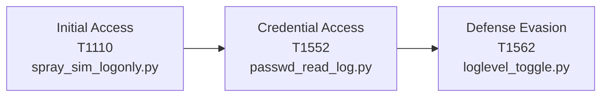

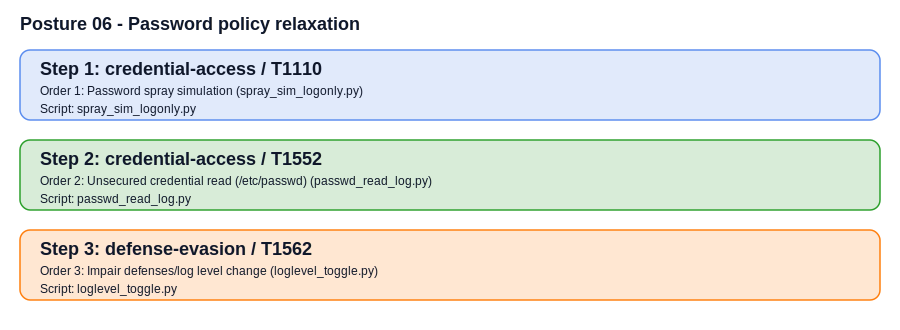

| Order | Phase              | Technique (ATT&CK)                    | Planned Script                    |
|-------|--------------------|---------------------------------------|-----------------------------------|
| 1     | Initial Access     | Brute Force / Spraying (T1110)        | spray_sim_logonly.py              |
| 2     | Credential Access  | Unsecured Credentials (T1552)         | passwd_read_log.py                |
| 3     | Defense Evasion    | Impair Defenses (T1562)               | loglevel_toggle.py                |

## 07 VPN trust expansion
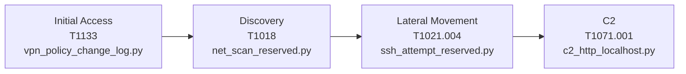

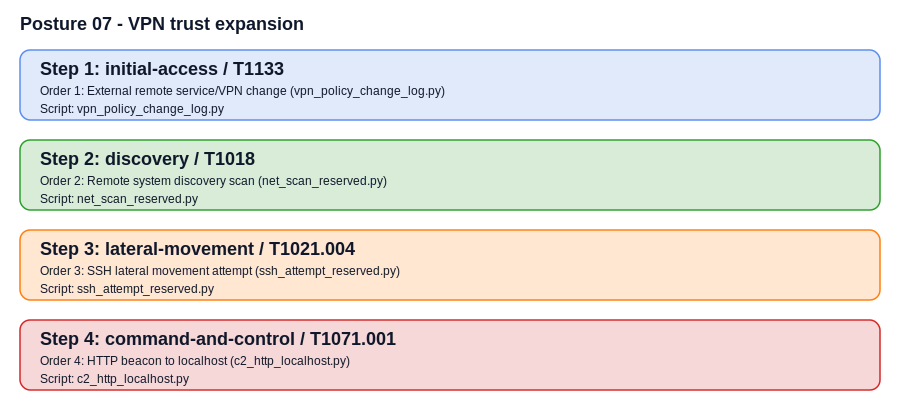

| Order | Phase              | Technique (ATT&CK)                      | Planned Script                    |
|-------|--------------------|-----------------------------------------|-----------------------------------|
| 1     | Initial Access     | External Remote Services (T1133)        | vpn_policy_change_log.py          |
| 2     | Discovery          | Remote System Discovery (T1018)         | net_scan_reserved.py              |
| 3     | Lateral Movement   | Remote Services: SSH (T1021.004)        | ssh_attempt_reserved.py           |
| 4     | Command & Control  | App Layer Protocol: Web (T1071.001)     | c2_http_localhost.py              |

## 08 Firewall temporary allow / IDS bypass
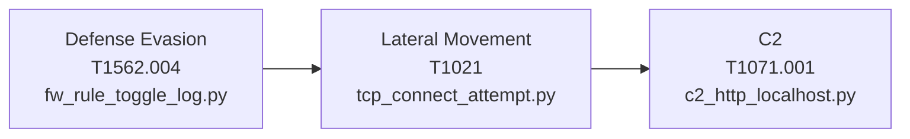

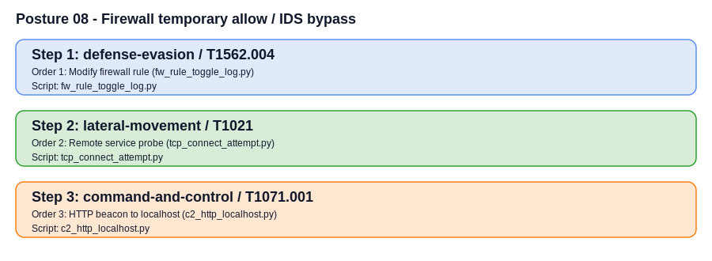

| Order | Phase              | Technique (ATT&CK)                       | Planned Script                    |
|-------|--------------------|------------------------------------------|-----------------------------------|
| 1     | Defense Evasion    | Modify Firewall (T1562.004)              | fw_rule_toggle_log.py             |
| 2     | Lateral Movement   | Remote Services (T1021)                  | tcp_connect_attempt.py            |
| 3     | Command & Control  | App Layer Protocol: Web (T1071.001)      | c2_http_localhost.py              |

## 09 Backup & recovery suppression
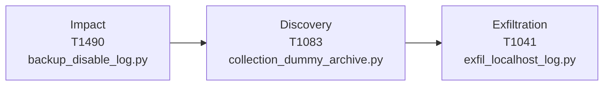

| Order | Phase              | Technique (ATT&CK)                     | Planned Script                    |
|-------|--------------------|----------------------------------------|-----------------------------------|
| 1     | Impact             | Inhibit System Recovery (T1490)        | backup_disable_log.py             |
| 2     | Discovery          | File and Directory Discovery (T1083)   | collection_dummy_archive.py       |
| 3     | Exfiltration       | Exfiltration Over C2 Channel (T1041)   | exfil_localhost_log.py            |

## 10 Service account credential exposure
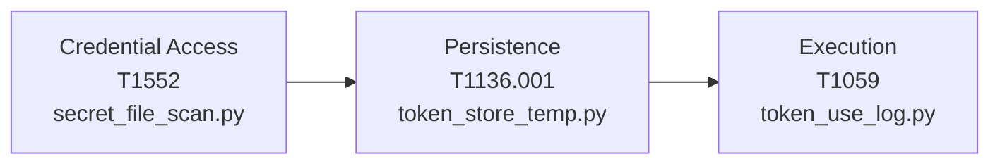

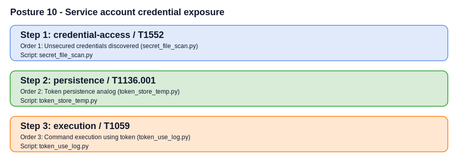

| Order | Phase              | Technique (ATT&CK)                    | Planned Script                    |
|-------|--------------------|---------------------------------------|-----------------------------------|
| 1     | Credential Access  | Unsecured Credentials (T1552)         | secret_file_scan.py               |
| 2     | Persistence        | Token Persistence                     | token_store_temp.py               |
| 3     | Execution          | Command Execution (T1059)             | token_use_log.py                  |

## 11 Logging/alert suppression
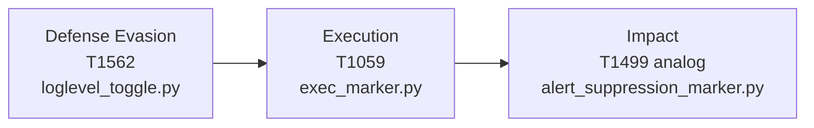

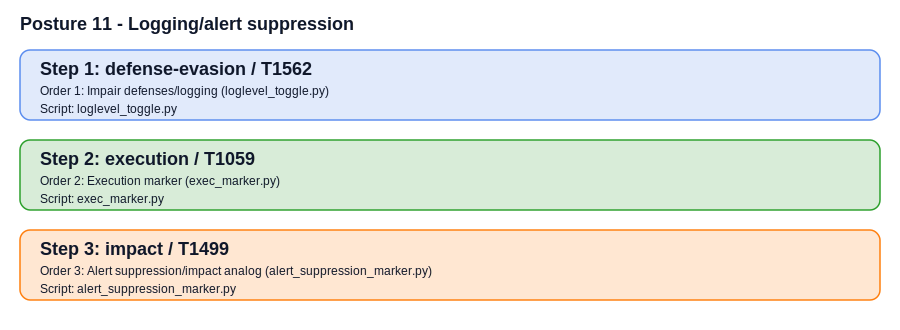

| Order | Phase              | Technique (ATT&CK)                         | Planned Script                    |
|-------|--------------------|--------------------------------------------|-----------------------------------|
| 1     | Defense Evasion    | Impair Defenses (T1562)                    | loglevel_toggle.py                |
| 2     | Execution          | Command Execution (T1059)                  | exec_marker.py                    |
| 3     | Impact             | Alert Suppression / Impact Analog          | alert_suppression_marker.py       |

## 12 Change control bypass
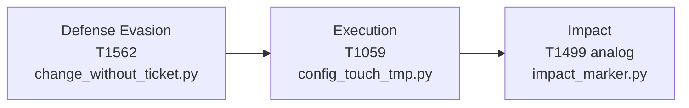

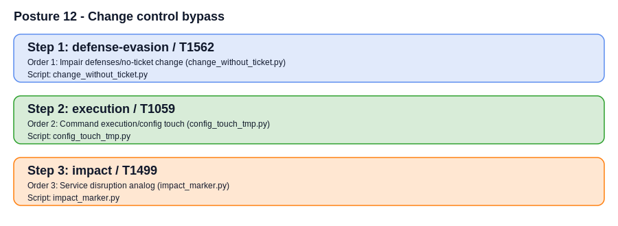

| Order | Phase              | Technique (ATT&CK)                         | Planned Script                    |
|-------|--------------------|--------------------------------------------|-----------------------------------|
| 1     | Defense Evasion    | Impair Defenses (T1562)                    | change_without_ticket.py          |
| 2     | Execution          | Command Execution (T1059)                  | config_touch_tmp.py               |
| 3     | Impact             | Service Disruption Analog                  | impact_marker.py                  |
